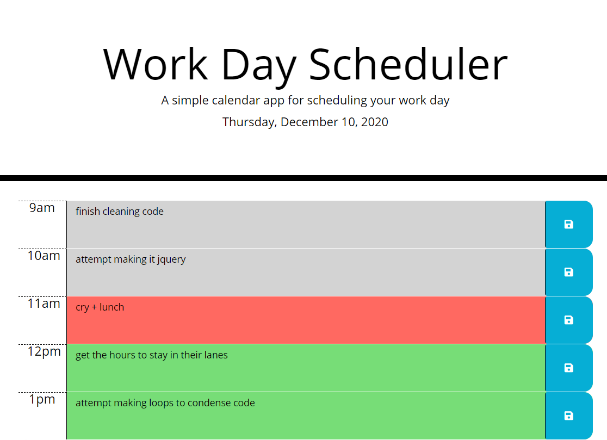

 # 9-to-5 Planner

## Description

This planner provides the user with the current Date and a 9-5 scheduling assistant by displaying each hour individually. The user is able to write in important events or tasks to work on for the respective hour, and save that input for future reference.

## Table of Contents

* [Installation](#installation)
* [Usage](#usage)
* [Credits](#credits)
* [License](#license)

## Installation

N/A

## Usage

The current date will automatically be displayed at the top of the page.
To add an event, simply type into the text box that corresponds with the appropriate hour in which you would like to do such task. Click on the icon to the right of the respective text box to save the content. This content will remain visible after saving until manually erased and the blank or new content is saved.

Please follow the following link to the quiz!
!(https://gabel35.github.io/Hourly_Planner/)

## Credits

dayjs for providing the date and time variables through their API
fontawesome.com for providing a free, easy to use icon for the save buttons

Thank you to all the TA's for your help and for group 2. Nella Larsen for the teamwork.

### License

N/A

-------------

Thank you!
